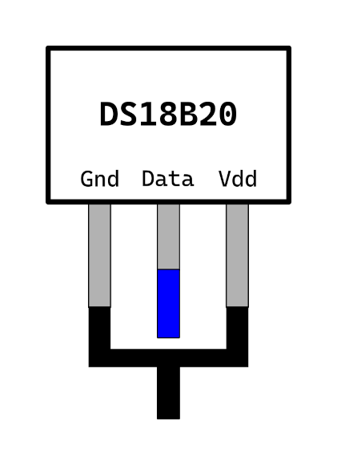
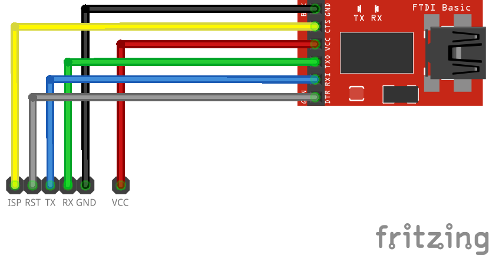
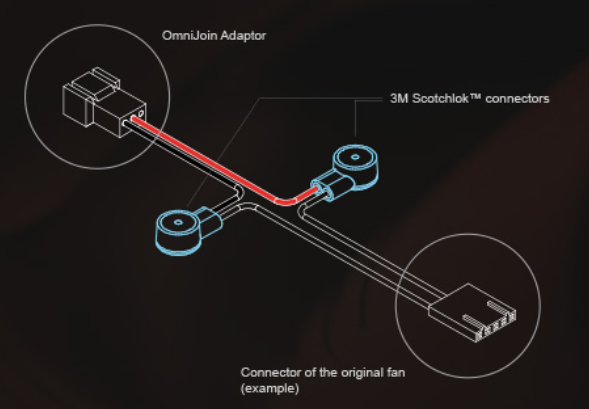
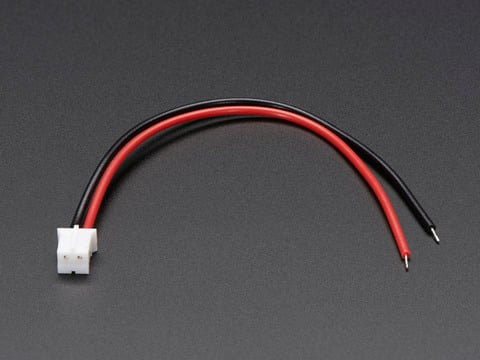

I made the mistake of buying a T-962 reflow oven without reading about it first. Turns out everyone already knows it's a piece of crap. Luckily, several enterprising hackers have fixed it up. These notes serve to expand on their work and clarify some points I found confusing.

[Prior Art](https://github.com/UnifiedEngineering/T-962-improvements)

## 1. Temperature/Time Accuracy

The temperature and time accuracy of this oven are atrocious. To fix this, we will add a temperature sensor and flash new firmware.

### 1.1 Temperature Sensor

The temperature sensor we will use is the [DS18B20](https://www.analog.com/media/en/technical-documentation/data-sheets/ds18b20.pdf). There are multiple vendors for this part, and some of them do not support the 1-wire operation mode which we will use. It is a three-pin package. The outer two leads should be connected together and tied to GND, and the inner lead is the "data" line which needs to be connected to the microcontroller.

- Fold outer leads down
- Tin outer leads together
- Solder wire to outer leads
- Solder wire to inner lead
- Add heatshrink tubing

You will need an SMD 4.7k resistor to act as a pullup. [This](https://www.mouser.com/ProductDetail/603-RT0402FRE074K7L) is one option.

### 1.2 Firmware

To flash firmware, you need to connect a USB TTL serial converter. Locate the pin header labeled `ISP` on the PCB.

Make the following connections from the converter to the ISP header:

- 3.3V ->
- Ground -> Ground
- TX -> RX
- RX -> TX
- CTS -> ISP
- DTR -> RST

## 2. Grounding

The chassis pieces are individually powder-coated, so the included grounding lug only grounds the rear panel of the chassis.

To solve this, you have two options: sand the powder coat off in specific spots or add more grounding wires.

### 2.1 Sanding

You need to sand the powder coat off of the following surfaces:

- The outer face of the rear panel around the screws which connect the rear panel to the top/bottom halves of the enclosure
- The area around the grounding lug on the rear panel

### 2.2 Adding wires

Use 12 gauge solid core wire, screws, and nuts to connect the mains ground to the top and bottom halves of the enclosure.

## 3. Fan

The PCB cooling fan is incredibly noisy. I replaced it with a [Noctua NF-A4x10 FLX](https://noctua.at/en/nf-a4x10-flx).

Two wiring methods are possible.

### 3.1 OmniJoin Adapters

Cut off the original fan cable with 2-pin JST connector. Attach each wire to a Scotchlok connector.

### 3.2 Rewire

Cut off the end of the Noctua fan cable. Wire the 12V and GND wires to a male 2-pin JST-PH connector.

