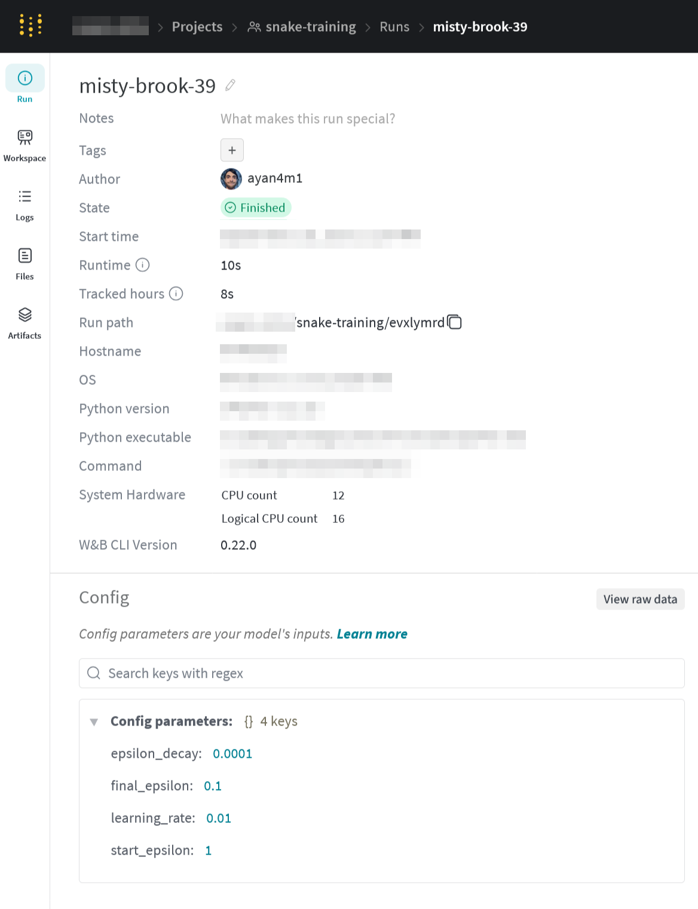

If you are using Weights and Biases, you probably already know how useful it can be when refining your reinforcement learning (RL) training strategy. If not, here's a quick overview of what it is, and my tip for how to use it best when iterating on a training agent.

## What is WandB?

[Weights and Biases](https://wandb.ai/) is a semi-free service that lets you stream log data to their servers during training and then visualize the data with graphs and reports on their website. The free tier limits you to 5GB of logs, which is plenty for the average hobbyist use-case. The most common way of using WandB is logging a data point for each training episode, with information like the CPU time taken, final reward value, and other domain-specific metadata. This is done using the `wandb.log` [method](https://docs.wandb.ai/guides/track/log/).

## wandb.init

Before you use `wandb.log`, you must call `wandb.init` to set up the logger. This is where you specify the project name to tie this run's data to. Here's an example:

```py
import wandb

wandb.init(
  entity = 'org-name',
  project = 'project-name'
)
```

This will get you up and running and is a perfectly fine way to start using wandb with [Gymnasium](https://gymnasium.farama.org/index.html) demo environments. However, once you start getting more in-depth, you will find that the `config` parameter gives you a powerful way to keep track of the slew of runs you will end up generating.

```py
import wandb

num_episodes = 10_000
# hyperparameters
learning_rate = 0.01
start_epsilon = 1.0
epsilon_decay = start_epsilon / (num_episodes / 2)
final_epsilon = 0.1

wandb.init(
  entity = 'vapor-wilco',
  project = 'snake-training',
  config={
    "learning_rate": learning_rate,
    "start_epsilon": start_epsilon,
    "epsilon_decay": epsilon_decay,
    "final_epsilon": final_epsilon,
    "discount_factor": discount_factor,
    "algorithm_name": "naive"
    "algorithm_version": 1
  }
)
```

Not only are we adding in all of our learning hyperparameters, we also add two hardcoded, free-text fields to the config. By using these `algorithm_name` and `algorithm_version` fields and changing them as our code evolves, you can keep track of exactly what piece of code was being used to generate a given run. If you click on a run in W&B, then click the "Run" tab on the left-hand menu, you will see the config values you logged at `init`:



I hope this strategy helps you use Weights and Biases to its fullest potential!
